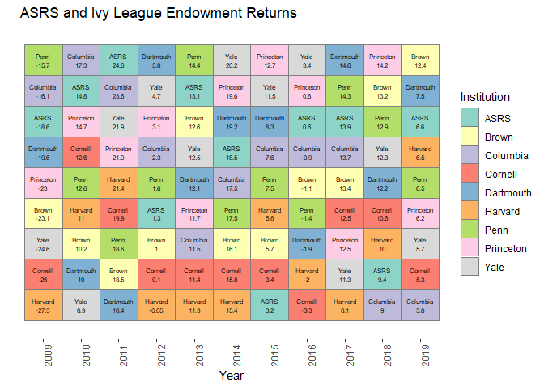

"League Tables" compare the outcome of firms pursuing a similar goal or market.  They are common in investment banking and some consultants prepare tables of asset class returns to show the evolution of comparative returns of assset classes over time.

In this post we show how to use `ggplot2` to present a league table.  The data we use compares total fund returns for the Arizona State Retirement System to Ivy League endowment funds.

The Ivy League return data is from [Markov Processes](https://www.markovprocesses.com/blog/measuring-the-ivy-2018-a-good-year-for-returns-but-is-efficiency-becoming-an-issue/)

First we prep the data.


Here is the human readable table of returns.


```r
kable(ar2)
```

              2009   2010   2011    2012   2013   2014   2015   2016   2017   2018
----------  ------  -----  -----  ------  -----  -----  -----  -----  -----  -----
ASRS         -18.6   14.8   24.6    1.30   13.1   18.5    3.2    0.6   13.9    9.4
Upenn        -15.7   12.6   18.6    1.60   14.4   17.5    7.5   -1.4   14.3   12.9
Columbia     -16.1   17.3   23.6    2.30   11.5   17.5    7.6   -0.9   13.7    9.0
Dartmouth    -19.6   10.0   18.4    5.80   12.1   19.2    8.3   -1.9   14.6   12.2
Princeton    -23.0   14.7   21.9    3.10   11.7   19.6   12.7    0.8   12.5   14.2
Brown        -23.1   10.2   18.5    1.00   12.6   16.1    5.7   -1.1   13.4   13.2
Yale         -24.6    8.9   21.9    4.70   12.5   20.2   11.5    3.4   11.3   12.3
Cornell      -26.0   12.6   19.9    0.10   11.4   15.8    3.4   -3.3   12.5   10.6
Harvard      -27.3   11.0   21.4   -0.05   11.3   15.4    5.8   -2.0    8.1   10.0

Here is what the data looks like when you area done preparing it in "long form" for ggplot2.


```r
head(arlong)
```

```
##   Year Institution rank Return             text
## 1 2009        ASRS    7  -18.6      ASRS\n-18.6
## 2 2009       Brown    4  -23.1     Brown\n-23.1
## 3 2009    Columbia    8  -16.1  Columbia\n-16.1
## 4 2009     Cornell    2  -26.0     Cornell\n-26
## 5 2009   Dartmouth    6  -19.6 Dartmouth\n-19.6
## 6 2009     Harvard    1  -27.3   Harvard\n-27.3
```

Finally, here is the code to prepare the plot.


```r
ggplot(arlong,aes(y=rank,x=Year,label=text))+
  scale_fill_brewer(palette="Set3")+
  geom_tile(aes(fill=Institution),colour="grey50")+
  geom_text(size=2)+
  scale_y_discrete()+
  ggtitle("ASRS and Ivy League Endowment Returns")+
  ylab("")+
  theme(
    panel.background=element_blank(),
    panel.grid.major=element_blank(),
    panel.grid.minor=element_blank(),
    axis.text.x=element_text(angle=90,hjust=1))
```

<!-- -->
